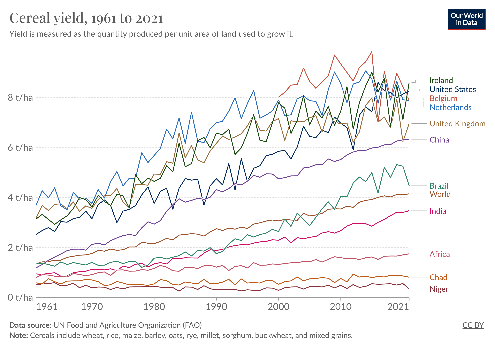
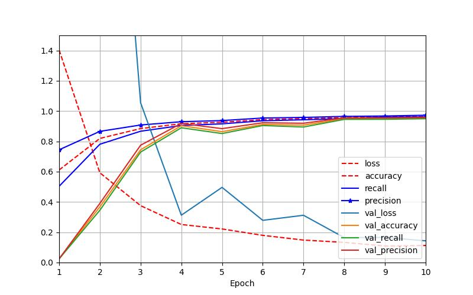

# Applying Convolutional Neural Networks to Plant Disease Diagnosis

---
**Student Name**: Briggs Twitchell  
**Course**: CS6140 - Machine Learning  
**Professor**: Dr. Prashant Mittal
**Date**: 12/12/2023

---
## Background
Agricultural productivity is important. It correlates with a reduction in poverty (likely a contributing factor):

source: https://ourworldindata.org/grapher/cereal-yield-vs-extreme-poverty-scatter

And it promotes biodiversity by reducing the land dedicated to agriculture:

source:https://ourworldindata.org/yields-vs-land-use-how-has-the-world-produced-enough-food-for-a-growing-population

Agricultural productivity has improved, but mostly in rich nations:

source: https://ourworldindata.org/africa-yields-problem

Africa has struggled to keep pace with the rest of the world's gains in crop yields. Its increase in total agricultural output since 1980 is primarily attributable to increased land use, not increased productivity:

source: https://ourworldindata.org/africa-yields-problem

This is an issue, because Africa is projected to experience almost all of the world's population growth in the next century (from ~1 to ~4 billion):

source: https://ourworldindata.org/region-population-2100

This threatens Africa's wealth of biodiversity:

source: https://ourworldindata.org/yields-habitat-loss

Therefore, Our World In Data has characterized it as one of the most important problems this century

Article: https://ourworldindata.org/africa-yields-problem

There are many relevant factors to addressing this issue. One factor that has the potential to contribute is **precision farming**.

I am specifically interested in means by which precision farming techniques can be applied through cost-effective, ubiquitous technologies, such as smart phones or drones. This could contribute to providing farmers in developing nations (such as many of those in Africa) a means to improve their crop yields.

---

## Precision farming 

According to a [study](./articles/finger-et-al-2019-precision-farming-at-the-nexus-of-agricultural-production-and-the-environment.pdf) by Annual Review of Resource Economics, "[t]echnological developments related to the digitalization of the agricultural sector are currently complemented by advances in data processing and robotics." Thus, there is an opportunity to apply the availability of data and computing power to improve crop yields.

Hughes and Salathé find: **"Currently, infectious diseases reduce the potential yield by an average of 40% with many farmers in the developing world experiencing yield losses as high as 100%."** Plant disease and yield reliability are closely linked to climate factors, so climate will likely only exacerbate this issue.

Importantly, Hughes and Salathé note "[t]he widespread distribution of smartphones among crop growers around the world... offers the potential of turning the smartphone into a valuable tool for diverse communities growing food." This hypothesis led to the development of the PlantVillage, a crowdsourced dataset containing a host of crop leaves with (or without) a labeled disease. 

## Dataset
Below is a sample of the [PlantVillage](https://data.mendeley.com/datasets/tywbtsjrjv/1) dataset, with each number corresponding to a leaf, disease combination:

Note that the dataset also includes pictures of healthy leaves for all of the categories. The raw dataset contains 61,486 images, but has six different augmentation techniques applied to it to increase its size. The techniques are image flipping, Gamma correction, noise injection, PCA color augmentation, rotation, and Scaling.

Below is set complete set of the classes for all the images within the dataset:

1. Apple_scab
2. Apple_black_rot
3. Apple_cedar_apple_rust
4. Apple_healthy
5. Background_without_leaves
6. Blueberry_healthy
7. Cherry_powdery_mildew
8. Cherry_healthy
9. Corn_gray_leaf_spot
10. Corn_common_rust
11. Corn_northern_leaf_blight
12. Corn_healthy
13. Grape_black_rot
14. Grape_black_measles
15. Grape_leaf_blight
16. Grape_healthy
17. Orange_haunglongbing
18. Peach_bacterial_spot
19. Peach_healthy
20. Pepper_bacterial_spot
21. Pepper_healthy
22. Potato_early_blight
23. Potato_healthy
24. Potato_late_blight
25. Raspberry_healthy
26. Soybean_healthy
27. Squash_powdery_mildew
28. Strawberry_healthy
29. Strawberry_leaf_scorch
30. Tomato_bacterial_spot
31. Tomato_early_blight
32. Tomato_healthy
33. Tomato_late_blight
34. Tomato_leaf_mold
35. Tomato_septoria_leaf_spot
36. Tomato_spider_mites_two-spotted_spider_mite
37. Tomato_target_spot
38. Tomato_mosaic_virus
39. Tomato_yellow_leaf_curl_virus

## Thesis
The development of precision farming tools can help give low-income farmers a cost-effective means to improve their crop yields. A major component of these tools will be plant and plant disease recognition software, implemented with computer vision techniques such as convolutional neural networks.

## Methods
I implemented six different neural networks, ranging from a simple deep neural network with two hidden layers to pre-trained convolutional neural networks (CNNs) drawing upon complex CNN architectures.

## Findings
Below are accuracy, recall, and precision scores for the models implemented:

There was significant variance between the pre-trained and simple models. The model with the best performance was the [Xception](/articles/Xception-Deep_Learning_with_Depthwise_Separable_Convolutions.pdf) model, which achieved 95.50% accuracy, 95.23% recall, and 95.89% precision. This model took 45 minutes to train on a Mac M1 with 16GB of RAM.

The [EfficientNet](/articles/EfficientNet-Rethinking_Model_Scaling_for_Convolutional_Neural_Networks.pdf) model was equally successful, achieving 95.12% accuracy, 94.79% recall, and 95.58% precision. This model took 47 minutes to train.

Below shows the training history for each model implemented (in order from best to worst performance):

#### Xception:

#### EfficientNet:

#### InceptionV3:

#### Traditional CNN, no pre-training:

#### Simple neural network (no convolutional layers):

## Convolutions and CNN architectures:
A convolutional layer within a neural network acts as a channel to filter out specific aspects from data, often images.

Convolution functions scan a 'window' over the input data and output a filtered version, which becomes a single channel within a set of channels that compose a convolutional layer. Each layer attempts to capture something different about the input it received.

Various sequences of convolutional layers determine that CNN's architecture:

Often, a traditional neural network is included as a final sequence of layers to synthesize the information generated from the convolutional layers:

### Inception architecture:
The Inception CNN architecture includes 'inception modules', which create parallel convolutional layers. These are basically filters that get concatenated together to create the same number of channels as there are filters. Inception modules apply this parallel convolving and then recombined the information with 'depth concatenation'.

This is an inception module:

And this is a zoomed out picture of the entire Inception architecture:

### Xception architecture:

The Xception CNN architecture is an extension of the Inception architecture replaces the inception modules with a 'depthwise separable convolutional layer.' This, in short, applies a spatial filter to each input feature map and then exclusively looks for cross-channel patterns. 

## My motivations for this project
This project was a means for me to combine several of my interest. My interest in agriculture is connected to my larger interest in helping reduce global poverty. Additionally, I wanted to become more familiar with CNNs and understand their applications.

Ultimately, my reading on the subject led me to identify one of the most important problems in the space of agriculture and search for technological applications that could help address this issue.

## Constraints/Issues
Due to issues in obtaining the original dataset, the dataset used here already had some augmentation applied to it, such as removing background noise (as is shown in the sample images above). This likely contributes positively to the performance of the models.

I'll also note that I wasted a lot of time attempting to set up a TensorFlow environment on the Khoury Discovery cluster. A conda environment isn't recommended for TensorFlow, and user access privileges on the cluster are restricted. Anyone that has a reliable pipeline for running TensorFlow on the cluster, please let me know. 

## Additional notes
* The directory structure used referenced in the code is slightly altered from the directory structure of the dataset from its original source. See the `dataset_structure.txt` file to see the directory structure modification. Changing the data according to this structure should allow the `create_models.py` script to run without errors.
* The code is implemented such that the trained models will be saved to the models directory.
* if `error_checking` is set to `True`, the code will run much quicker. This can be used to do a simple pass through the `create_models.py` file to ensure that each model can compile prior to training on the entire dataset.

